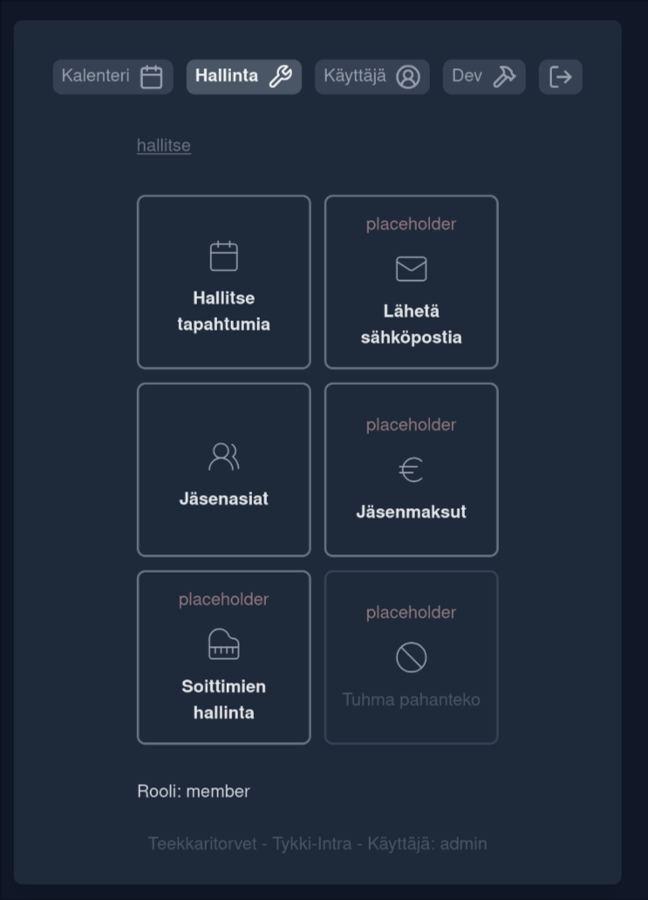

# Tykki-Intra - A showcase

This repo is for showcasing my private full stack project.

Tykki-Intra is a orchester management web application to one day (maybe) replace the good old SoppaIntra. Intended main features include event scheduling and membership management.

Frontend: Svelte (typescript)
Backend: Axum (rust)

## Screenshots

### Login Screen

### Band Management

