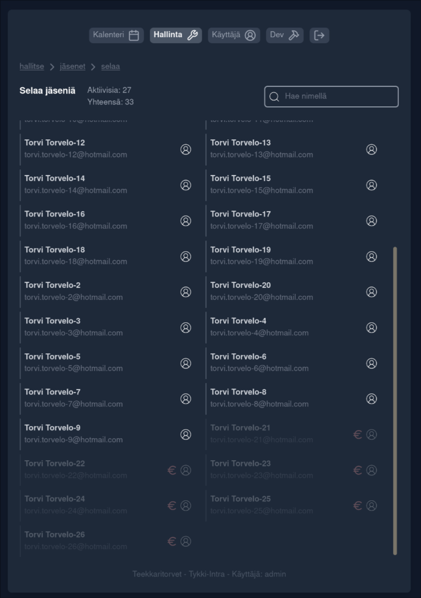

# Tykki-Intra - A showcase

This repo is for showcasing my private full stack project.

Tykki-Intra is a orchester management web application to one day (maybe) replace the good old SoppaIntra. Intended main features include event scheduling and membership management.

# Tech

## Backend
🦀 __Axum__ (rust): ~1.5k lines of code. *Blazingly fast!*

📦 Using libraries such as:

-serde
-SeaORM
-lettre
-dotenvy
-jsonwebtoken.

## Frontend
🖥️ __SvelteKit__ (typescript): ~1.3k lines of code. *Graceful and stylish*

✨ --Tailwind CSS__: *Why write raw CSS?*

## Database
🗄️ __SQLite__ (sql): *Simple and lightweight*

# Screenshots

### Login Screen

### Band Management

### Browse Members

